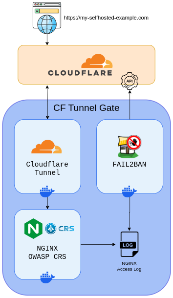
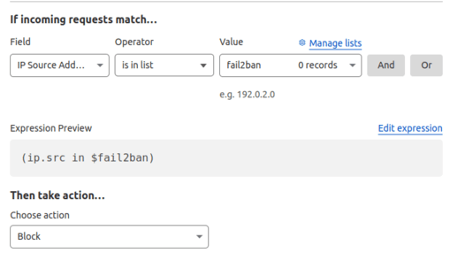

# cf-tunnel-gate

CF Tunnel Gate is a Docker compose project designed to easily deploy and configure these components as a collection of integrated Docker containers.  Basic usage is covered in a handful of environment variables, please see each project for detailed configuration information.

Backing Containers:
- [cloudflare/cloudflared](https://hub.docker.com/r/cloudflare/cloudflared)
- [binbashing/owasp-crs-ngxblocker](https://hub.docker.com/r/binbashing/owasp-crs-ngxblocker)
- [binbashing/fail2ban-cf-iplist](https://hub.docker.com/r/binbashing/fail2ban-cf-iplist)

### Installation

#### Cloudflare setup:
1. Create a Cloudflare Tunnel [(How-to)](https://developers.cloudflare.com/cloudflare-one/connections/connect-networks/get-started/create-remote-tunnel/).
  - Set the tunnel `Service` to `https://cf-tunnel-gate:8443` (_Section 2, Step 2 of the above How-to_)
2. Generate a Cloudflare API Key with the following permissions [(How-to)](https://developers.cloudflare.com/fundamentals/api/get-started/create-token/).
  - `Account:Account Filter Lists:Edit`
  - `Account:Account Filter Lists:Read`
  - `Account:Account Settings: Read`
3. Create a Cloudflare Custom IP List named `fail2ban` [(How-to)](https://developers.cloudflare.com/waf/tools/lists/create-dashboard/)

4. Create A Cloudflare Custom WAF Rule which block traffic from IPs in the `fail2ban` custom list. [(How-to)](https://developers.cloudflare.com/waf/custom-rules/create-dashboard/)

##### Local setup:

1. Make sure you have [Docker](https://docs.docker.com/engine/install/), [Docker Compose](https://docs.docker.com/compose/install/) and [git](https://git-scm.com/downloads) installed

2. Clone the CF Tunnel Gate repository
  `git clone https://github.com/binbashing/cf-tunnel-gate.git`

3. Using `.env.example` as a template create your `.env` file and set the necessary values.

4. Start the containers with `docker compose up -d`

5. Test that your proxied service is available via your tunnel URL.

6. Configure nightly updates.  A simple cron to run `docker compose restart` or restart of the host is recommended to get regular updates.
