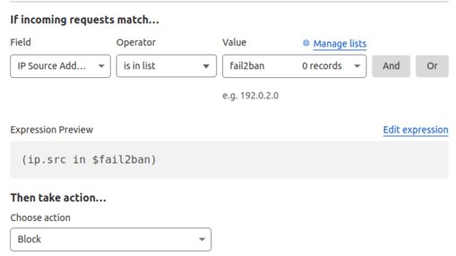

# Securing Self-Hosted Services with CF Tunnel Gate
I recently created a new project called ["CF Tunnel Gate"](https://github.com/binbashing/cf-tunnel-gate) to help increase the security of my self-hosted services. I have been self-hosting personal projects for a long time and have always been concerned with the volume of bot and malicious-looking traffic I received. Over the years, I've experimented with various tools to mitigate these threats. This project aims to package together some of these tools into an easy-to-deploy solution that others can utilize.

---
### Goals of the Project

- ##### Protect My Home Public IP: 
>I'd prefer not to expose or rely on my public IP address. Your public IP discloses personal information like your location, and residential ISPs and network equipment aren't designed to handle things like DDoS attacks and hacking attempts.

- ##### Implement a Web Application Firewall:
>WAF technology has become commonplace in the commercial hosting world, and I'd like to have a similar level of protection for my self-hosting. I aim to implement features such as rate limiting, common rule sets, and block lists.

- ##### Open Source and Free: 
>I aim to avoid any subscription fees for things I self-host, and I prefer open source when possible.

- ##### Always Up to Date:
>Components should be automatically updated, and rule sets and block lists should always be at the latest versions.

- ##### Easy to Use:
>Simplicity is key. I want this project to be accessible to users of all levels of technical expertise, with straightforward deployment and configuration processes that make it easy to get started and maintain.

- ##### Able to Run on a Raspberry Pi:
>My self-hosting setup is made up mostly of Raspberry Pi devices; this means services must support ARM architecture and have a small footprint.

---
### Project Components

- ##### Cloudflare Tunnel: 
>[Cloudflare Tunnel](https://developers.cloudflare.com/cloudflare-one/connections/connect-networks/), formerly known as Argo Tunnel, establishes a secure connection between our self-hosted services and the Cloudflare network. This allows access to self hosted services using Cloudflare public IPs with added benefits like network layer DDoS protection, custom block lists and basic bot protections. Unfortunately features like advanced bot detection, managed WAF rule sets and block lists are not available on the free tier.

- ##### NGINX Reverse Proxy with Mod Security:
>Our Cloudflare tunnel will point at an [NGINX reserve proxy](https://www.nginx.com/resources/glossary/reverse-proxy-server/),  NGINX is configured to proxy the traffic to the self hosted service that we wish to make public.  CF Tunnel Gate provides NGINX with [Mod Security](https://github.com/owasp-modsecurity/ModSecurity) to add Web Application Firewall (WAF) capabilities.

- ##### OWASP Core Rule Set for ModSecurity:
>The [OWASP Core Rule Set (CRS)](https://owasp.org/www-project-modsecurity-core-rule-set/) is a WAF rule set provided by the Open Web Application Security Project (OWASP) to protect against common web application security threats, including those outlined in the [OWASP Top 10](https://owasp.org/www-project-top-ten/). CF Tunnel Gate provides these rules in NGINX ModSecurity to detect and block malicious traffic, such as SQL injection, cross-site scripting (XSS), and other common vulnerabilities.  This will provide added protection similar to the manged rule sets offered in the Cloudflare paid tier.

- ##### NGINX Ultimate Bad Bot Blocker:
>[mitchellkrogza/nginx-ultimate-bad-bot-blocker](https://github.com/mitchellkrogza/nginx-ultimate-bad-bot-blocker) project provides continuously updated block lists and configurations for NGINX designed to block malicious IPs, bots and crawlers. This will provide added protection similar to the "Super Bot Fight Mode" and managed IP lists available with Cloudflare pair tier.

- ###### Fail2ban with Custom IP List in Cloudflare:
>[Fail2ban](https://github.com/fail2ban/fail2ban) is an Intrusion Detection System (IDS) that monitors logs for suspicious activity and takes defined block actions in response. CF Tunnel Gate configures Fail2ban to monitor NGINX access logs to find traffic repeatedly blocked by OWASP CRS and Ultimate Bad Bot Blocker and add those IPs to Cloudflare custom IP lists to block this traffic it before reaches our network.

---
### How it Works

CF Tunnel Gate is simply a Docker compose project designed to easily deploy and configure these components as a collection of integrated Docker containers.  Basic usage is covered in a handful of environment variables, please see each project for detailed configuration information.
Containers:
- [cloudflare/cloudflared](https://hub.docker.com/r/cloudflare/cloudflared)
- [binbashing/owasp-crs-ngxblocker](https://hub.docker.com/r/binbashing/owasp-crs-ngxblocker)
- [binbashing/fail2ban-cf-iplist](https://hub.docker.com/r/binbashing/fail2ban-cf-iplist)

---
###Installation

##### Cloudflare setup:
1. Create a Cloudflare Tunnel [(How-to)](https://developers.cloudflare.com/cloudflare-one/connections/connect-networks/get-started/create-remote-tunnel/).
  - Set the tunnel `Service` to `https://cf-tunnel-gate:8443` (_Section 2, Step 2 of the above How-to_)
2. Generate a Cloudflare API Key with the following permissions [(How-to)](https://developers.cloudflare.com/fundamentals/api/get-started/create-token/).
  - `Account:Account Filter Lists:Edit`
  - `Account:Account Filter Lists:Read`
  - `Account:Account Settings: Read`
3. Create a Cloudflare Custom IP List named `fail2ban` [(How-to)](https://developers.cloudflare.com/waf/tools/lists/create-dashboard/)

4. Create A Cloudflare Custom WAF Rule which block traffic from IPs in the `fail2ban` custom list. [(How-to)](https://developers.cloudflare.com/waf/custom-rules/create-dashboard/)

##### Local setup:

1. Make sure you have [Docker](https://docs.docker.com/engine/install/), [Docker Compose](https://docs.docker.com/compose/install/) and [git](https://git-scm.com/downloads) installed

2. Clone the CF Tunnel Gate repository
  `git clone https://github.com/binbashing/cf-tunnel-gate.git`

3. Using `.env.example` as a template create your `.env` file and set the necessary values.

4. Start the containers with `docker compose up -d`

5. Test that your proxied service is available via your tunnel URL.

6. Configure nightly updates.  A simple cron to run `docker compose restart` or restart of the host is recommended to get regular updates.

---
### Conclusion

  That's it! With CF Tunnel Gate, your self-hosted services are now not only publicly accessible via Cloudflare's network but also fortified with a suite of robust security enhancements and protections. From shielding your home public IP to implementing a powerful Web Application Firewall (WAF) and Intrusion Detection System (IDS), this project has equipped your infrastructure with the tools needed to repel malicious attacks and safeguard your data and privacy.

  I hope this gives people the added confidence to self-host more sensitive services like cloud file storage and password managers for themselves and their loved ones. I encourage you to keep an eye on your logs and review your traffic from time to time. Hopefully, you will notice a dramatic drop in bots and malicious traffic visiting your site.

Feel free to leave questions and comments below. Happy hosting!
